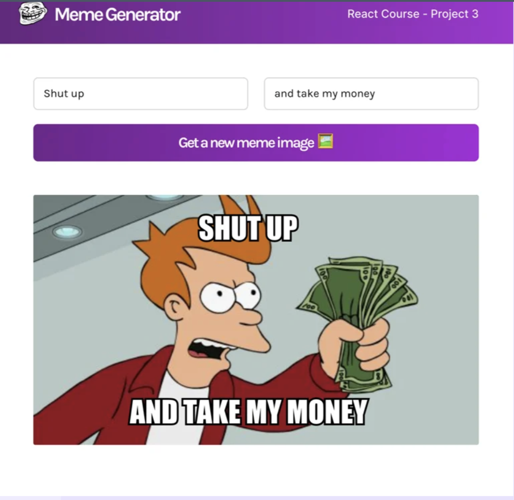

# 🎭 Meme Generator

A fun and interactive React application that lets you create custom memes using popular meme templates from the internet. Built with React, Vite, and the Imgflip API.



## ✨ Features

- 🖼️ **Random Meme Templates**: Get random meme images from a vast collection via the Imgflip API
- ✍️ **Custom Text**: Add your own top and bottom text to create personalized memes
- ⚡ **Real-time Preview**: See your meme update instantly as you type
- 🎨 **Clean UI**: Modern and intuitive interface with Google Fonts integration
- 📱 **Responsive Design**: Works great on desktop and mobile devices

## 🚀 Getting Started

### Prerequisites

- Node.js (version 14 or higher)
- npm or yarn

### Installation

1. Clone the repository:
```bash
git clone https://github.com/Greendayy/Meme-Generator.git
cd Meme-Generator
```

2. Install dependencies:
```bash
npm install
```

3. Start the development server:
```bash
npm run dev
```

4. Open your browser and navigate to `http://localhost:5173`

## 🛠️ Built With

- **React** (^18.2.0) - Frontend library
- **Vite** (^3.0.7) - Build tool and development server
- **CSS3** - Styling
- **Imgflip API** - Meme image source
- **Google Fonts (Karla)** - Typography

## 📁 Project Structure

```
Meme-Generator/
├── public/
│   ├── troll-face.png
│   ├── WechatIMG23.png
│   └── vite.svg
├── src/
│   ├── App.jsx
│   ├── App.css
│   └── main.jsx
├── Components/
│   ├── Navbar.jsx
│   └── Meme.jsx
├── index.html
├── package.json
├── vite.config.js
└── README.md
```

## 🎯 How It Works

1. The app fetches popular meme templates from the [Imgflip API](https://imgflip.com/api)
2. Users can click "Get a new meme image" to randomly select a meme template
3. Users can add custom text in the top and bottom input fields
4. The meme updates in real-time with the overlay text positioned on the image

## 📝 Available Scripts

- `npm run dev` - Start development server
- `npm run build` - Build for production
- `npm run preview` - Preview production build locally

## 🎨 Customization

The app uses CSS for styling with custom classes:
- `.form` - Styling for the input form
- `.meme` - Container for the meme image and text
- `.meme-text` - Styling for overlay text (top/bottom positioning)

## 🔗 API Reference

This project uses the Imgflip API:
- **Endpoint**: `https://api.imgflip.com/get_memes`
- **Method**: GET
- **Response**: Returns an array of popular meme templates with URLs

## 🤝 Contributing

1. Fork the project
2. Create your feature branch (`git checkout -b feature/AmazingFeature`)
3. Commit your changes (`git commit -m 'Add some AmazingFeature'`)
4. Push to the branch (`git push origin feature/AmazingFeature`)
5. Open a Pull Request

## 📚 Learning Resources

This project was inspired by and follows tutorials from:
- **Figma Design**: [Meme Generator Design](https://www.figma.com/file/MoLwFPHNHJVrzdFurxHzNV/Meme-Generator?node-id=0%3A1)
- **Scrimba Tutorial**: [Learn React Course](https://scrimba.com/learn/learnreact/using-an-async-function-inside-useeffect-clone-cw73rRud)

## 📄 License

This project is open source and available under the [MIT License](LICENSE).

## 🙏 Acknowledgments

- Thanks to Imgflip for providing the free meme API
- Inspired by classic meme generators across the web
- Built as a learning project following React best practices

---

**Happy Meme Making!** 😄🎉
